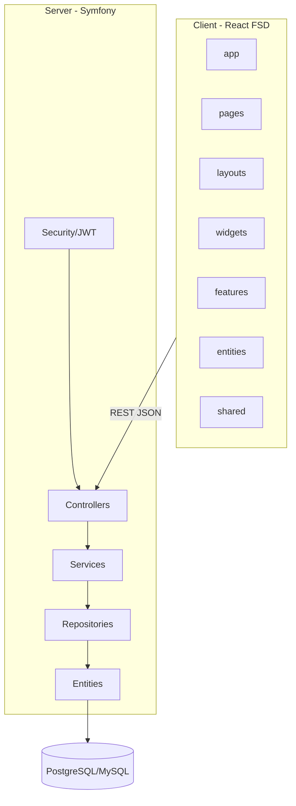
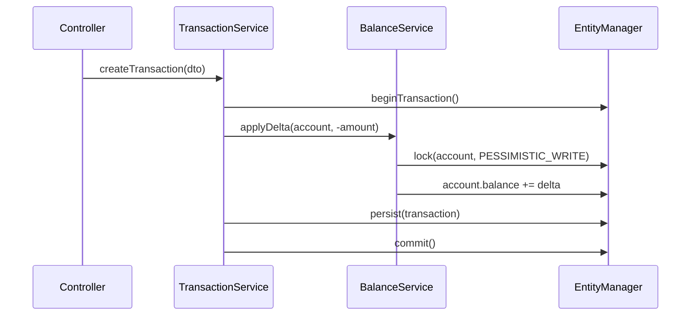

# Архитектура приложения «Учёт финансов»

## Обзор решения

Веб-приложение для совместного учёта финансов: Symfony (бэкенд) + React/FSD (фронтенд).  
**Принцип:** эволюционная доработка существующего `server/`, полная реструктуризация `client/` под FSD.

### Ключевые решения

1. **Backend — сохранить структуру `server/src/`**: `IncCom/` (домен), `Main/` (пользователи), `App/` (инфраструктура). Новые сущности и сервисы добавляются в `IncCom/`, не переписывая с нуля.
2. **Эволюция сущностей, не big-bang**: `Category`→TransactionCategory, `Tag`→ItemCategory, `Product`→Item — через миграции и постепенный rename классов. Таблицы `inccom_*` сохраняются.
3. **Frontend — реструктуризация под FSD**: исправить `entites/`→`entities/`, вынести `layouts/`, добавить `widgets/`, разделить API по сущностям.

---

## Компоненты системы



| Модуль | Ответственность |
|--------|-----------------|
| `App/` | JWT, CORS, Kernel, общие контроллеры auth |
| `Main/` | User, регистрация, профиль |
| `IncCom/` | Счета, транзакции, категории, товары, переводы |
| `client/app` | Провайдеры (Mantine, Query, Router), инициализация |
| `client/entities` | Модели, API-хуки, Zustand-сторы по сущностям |
| `client/features` | Сценарии: формы, QR-сканер, копирование категорий |
| `client/pages` | Композиция features + widgets |
| `client/shared` | UI-kit, API-клиент, утилиты (QR-парсер) |

---

## Структуры данных

См. [DATABASE_SCHEMA.md](./DATABASE_SCHEMA.md).

**Главные связи:**
- Account (master + participants) → TransactionCategory, Transaction
- User → ItemCategory (дерево), Item (M2M категории)
- Transaction → TransactionItem[] (расходы)
- Transfer → 2× Transaction (expense + income)

---

## API и интерфейсы

См. [API_SPEC.md](./API_SPEC.md).

**Миграция путей:**

| Legacy | Target |
|--------|--------|
| `/api/inc-com/account` | `/api/accounts` |
| `/api/inc-com/category` | `/api/accounts/{id}/categories` |

---

## Технологический стек

### Backend (фактический)

| Компонент | Версия | Примечание |
|-----------|--------|------------|
| PHP | 8.2+ | ✅ |
| Symfony | **7.3** | ТЗ: 6+; совместимо |
| Doctrine ORM | 3.4 | ✅ |
| lexik/jwt-authentication-bundle | 3.1 | ✅ |
| gesdinet/jwt-refresh-token-bundle | 1.5 | ✅ |
| nelmio/cors-bundle | 2.5 | ✅ |

### Frontend (фактический)

| Компонент | Версия | Примечание |
|-----------|--------|------------|
| React | 19.2 | ✅ |
| TypeScript | 5.8 | ✅ |
| Vite | 7.3 | ✅ |
| Mantine | 8.3 | ✅ |
| Zustand | 5.0 | ✅ |
| TanStack React Query | 5.90 | ✅ |
| react-router-dom | 7.13 | ✅ |
| axios | 1.13 | API-клиент |

### Добавить

| Компонент | Назначение |
|-----------|------------|
| `@yudiel/react-qr-scanner` или `html5-qrcode` | QR-сканер (react-qr-reader устарел) |

---

## Файловая структура

### Backend (целевая, доработка `server/src/`)

```
server/src/
├── App/                          # инфраструктура (без изменений)
│   ├── Controller/
│   │   └── ApiAuthController.php # обёртка auth по ТЗ
│   └── Security/
├── Main/                         # User (без изменений)
│   ├── Entity/User.php
│   ├── Repository/
│   └── Service/MainManager.php
├── IncCom/
│   ├── Entity/
│   │   ├── Account.php           # 🔄 +participants, +currency, +number
│   │   ├── TransactionCategory.php  # rename from Category
│   │   ├── ItemCategory.php      # rename from Tag
│   │   ├── Item.php              # refactor from Product
│   │   ├── Transaction.php       # 🔄 +isManualAmount, +mcc, +items
│   │   ├── TransactionItem.php   # ➕
│   │   └── Transfer.php          # ➕
│   ├── Repository/
│   ├── Service/
│   │   ├── IncComManager.php     # 🔄 расширить
│   │   ├── BalanceService.php    # ➕
│   │   ├── TransactionService.php
│   │   ├── TransferService.php
│   │   └── CategoryCopyService.php
│   ├── Controller/
│   │   ├── AccountsController.php
│   │   ├── TransactionCategoriesController.php
│   │   ├── ItemCategoriesController.php
│   │   ├── ItemsController.php
│   │   ├── TransactionsController.php
│   │   └── TransfersController.php
│   ├── Security/Voter/           # ➕
│   ├── DTO/                      # ➕ Request/Response
│   └── Enum/
│       ├── AccountType.php
│       └── TransactionType.php
├── AbstractManager.php           # ✅ переиспользовать
└── AbstractRepository.php        # ✅ переиспользовать
```

### Frontend (целевая FSD)

```
client/src/
├── app/
│   ├── providers/          # Mantine, QueryClient, Router
│   ├── styles/
│   └── index.tsx
├── pages/
│   ├── auth/               # sign-in, sign-up
│   ├── accounts/           # список, детали
│   ├── transactions/       # список, форма
│   ├── items/              # товары
│   ├── item-categories/    # дерево категорий
│   └── main/
├── layouts/
│   ├── auth-layout/
│   └── main-layout/        # меню, header (из shared/layout)
├── widgets/
│   ├── account-list/
│   ├── transaction-table/
│   ├── category-tree/
│   └── balance-summary/
├── features/
│   ├── auth/
│   ├── account-form/
│   ├── transaction-form/   # + QR scanner
│   ├── transfer-form/
│   ├── category-copy/
│   └── item-category-tree/
├── entities/
│   ├── user/
│   ├── account/
│   ├── transaction/
│   ├── transaction-category/
│   ├── item/
│   ├── item-category/
│   └── transfer/
└── shared/
    ├── api/                # axios instance, interceptors
    ├── ui/                 # кнопки, спиннеры, таблицы
    ├── lib/                # qr-parser, formatters
    ├── config/
    └── types/              # PaginatedResponse<T>
```

### Public API сущностей (frontend)

Каждая `entities/<name>/` экспортирует:
```
index.ts          # public API слоя
model/types.ts    # интерфейсы
api/<name>.ts     # request-функции
api/queries.ts    # useQuery/useMutation хуки
ui/               # карточки, бейджи (опционально)
```

---

## Клиентская архитектура (FSD)

### Слои и зависимости

```
app → pages → widgets → features → entities → shared
         ↘ layouts ↗
```

### Ключевые хуки (React Query)

| Хук | Сущность | Операции |
|-----|----------|----------|
| `useAccounts` | account | list, create, update, delete |
| `useAccountUsers` | account | add/remove participants |
| `useTransactionCategories` | transaction-category | CRUD, copy |
| `useItemCategories` | item-category | CRUD, tree, search |
| `useItems` | item | CRUD, search |
| `useTransactions` | transaction | CRUD, filters |
| `useTransfers` | transfer | CRUD |
| `useAuth` | user | login, register, logout, me |

### Zustand (локальное UI-состояние)

| Store | Назначение |
|-------|------------|
| `useAuthStore` | токены (уже есть) |
| `useUiStore` | тема, sidebar |
| `useTransactionFormStore` | черновик формы расхода, QR-данные |

> Серверные данные — только React Query, не дублировать в Zustand.

### QR-сканер

```
features/transaction-form/
├── ui/TransactionForm.tsx
├── ui/QrScannerModal.tsx
└── lib/parse-fiscal-qr.ts   # парсинг строки QR (t=, s=, fn=, fp=, i=)
```

Библиотека: `@yudiel/react-qr-scanner` (активно поддерживается, React 19).

---

## Бизнес-логика баланса



**Правила:**
- `income` → `balance += amount`
- `expense` → `balance -= amount`
- Update: `balance += (newAmount - oldAmount)` с учётом type
- Delete: обратная операция
- Transfer: expense на from, income на to — в одной DB-транзакции

---

## Анализ расхождений с ТЗ

### Backend — реализовано

| Компонент | Статус |
|-----------|--------|
| User + JWT auth | ✅ |
| Account CRUD | ✅ частично (нет participants, currency, number) |
| TransactionCategory CRUD | ✅ (как Category) |
| Account balance field | ✅ (без автообновления) |
| Fiscal fields fn/fp/fd | ✅ в Transaction entity |
| Optimistic locking (x_timestamp) | ✅ |

### Backend — не реализовано / расходится

| Компонент | Проблема |
|-----------|----------|
| Участники счёта (M2M) | ❌ только owner |
| Transaction API | ❌ нет контроллера |
| Transfer | ❌ link_id вместо Transfer entity |
| TransactionItem | ❌ Product привязан к transaction |
| Item/ItemCategory | ❌ Tag/Product — другая модель |
| BalanceService | ❌ баланс не обновляется |
| isManualAmount, mcc на Transaction | ❌ mcc на Category |
| Пагинация page/size | ❌ limit/offset |
| Права (Voters) | ❌ нет проверок |
| Category copy | ❌ |
| Account delete guard | ❌ |

### Frontend — реализовано

| Компонент | Статус |
|-----------|--------|
| React 19 + Vite + Mantine + RQ + Zustand | ✅ |
| Auth (login) | ✅ |
| Accounts list/form | ✅ частично |
| Categories list/form | ✅ частично |
| FSD-скелет | 🔄 entites/, layouts в shared |

### Frontend — не реализовано

| Компонент | Статус |
|-----------|--------|
| Правильная FSD-структура | ❌ |
| Transactions, Items, Transfers | ❌ |
| QR-сканер | ❌ |
| Управление участниками | ❌ |
| Пагинация/фильтры по ТЗ | ❌ |

---

## Открытые решения (с рекомендациями)

| Вопрос | Рекомендация |
|--------|--------------|
| Rename классов Category→TransactionCategory? | Да, но в 2 этапа: alias-класс, затем rename файла |
| Сохранять `/api/inc-com/*`? | Deprecated-адаптер на 1 спринт, затем удалить |
| Symfony 7 vs ТЗ «Symfony 6» | Оставить 7.3, обновить ТЗ |
| User.login vs email для auth | Оставить login (текущее), email — опционально |
| keywords: JSON или TEXT? | JSON-массив в Doctrine `Types::JSON` |
| QR-библиотека | `@yudiel/react-qr-scanner` |

---

## Безопасность

- JWT stateless для `/api/*`
- Voters на уровне сущностей
- `number` счёта — фильтрация в DTO/Serializer по `isMaster`
- Все мутации транзакций — проверка `author === currentUser`
- DB-транзакции для Transfer и balance updates
