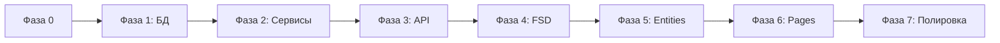

# План реализации

> Учитывает текущее состояние кода. Backend — эволюционная доработка, Frontend — реструктуризация под FSD.

## Легенда

- ✅ — можно переиспользовать из текущего кода
- 🔄 — доработать существующее
- ➕ — создать с нуля
- **Зависит от:** — блокирующие этапы

---

## Фаза 0. Подготовка инфраструктуры

- [ ] **0.1** Настроить алиасы путей API: добавить `/api/accounts` параллельно `/api/inc-com/account` ➕
- [ ] **0.2** Создать `PaginationService` + DTO `PaginatedResponse` (page/size по ТЗ) ➕
- [ ] **0.3** Создать базовые Enum: `AccountType`, `TransactionType` ➕
- [ ] **0.4** Создать `AccountAccessService` (проверка master/participant) ➕

**Переиспользование:** `AbstractRepository` ✅, `AbstractManager` ✅

---

## Фаза 1. Backend — схема БД и сущности

**Зависит от:** 0.3

- [ ] **1.1** Миграция Account: +description, +currency, +number, +createdAt; M2M `inccom_account_user` 🔄
- [ ] **1.2** Миграция TransactionCategory (Category): убрать mcc, +createdAt; rename owner→createdBy в коде 🔄
- [ ] **1.3** Миграция ItemCategory (Tag): +keywords, убрать sort/level 🔄
- [ ] **1.4** Рефакторинг Item (Product): user вместо transaction, +description, +unit, unique(user, name) 🔄
- [ ] **1.5** Миграция Transaction: +mcc, +fpd, +isManualAmount, +transfer_id; убрать link_id, loaded 🔄
- [ ] **1.6** Создать TransactionItem entity + миграция ➕
- [ ] **1.7** Создать Transfer entity + миграция ➕
- [ ] **1.8** Миграция данных: link_id → Transfer (если есть данные) 🔄

**Переиспользование:** существующие Entity-файлы как основа ✅, миграции Doctrine ✅

---

## Фаза 2. Backend — сервисы и бизнес-логика

**Зависит от:** 1.1–1.7

- [ ] **2.1** `BalanceService`: applyDelta, lock, optimistic version 🔄 (поле balance ✅)
- [ ] **2.2** `TransactionService`: create/update/delete, пересчёт amount, isManualAmount ➕
- [ ] **2.3** `TransferService`: атомарное создание пары транзакций ➕
- [ ] **2.4** `CategoryCopyService`: копирование с проверкой дублей ➕
- [ ] **2.5** Расширить `IncComManager`: делегирование в новые сервисы 🔄
- [ ] **2.6** Guards: запрет удаления Account/Category/Item при зависимостях ➕

**Переиспользование:** `IncComManager::account()`, `::category()` ✅

---

## Фаза 3. Backend — Security и API

**Зависит от:** 2.1–2.6

- [ ] **3.1** Voters: Account, Transaction, TransactionCategory, Item, Transfer ➕
- [ ] **3.2** `AccountsController` по ТЗ (замена/расширение AccountController) 🔄
  - Переиспользовать: CRUD-логику, репозиторий ✅
  - Добавить: participants, currency, number masking, delete guard
- [ ] **3.3** `TransactionCategoriesController` (вложенный роут + copy) 🔄
- [ ] **3.4** `ItemCategoriesController` ➕ (на базе Tag entity)
- [ ] **3.5** `ItemsController` ➕ (на базе Product entity)
- [ ] **3.6** `TransactionsController` ➕
- [ ] **3.7** `TransfersController` ➕
- [ ] **3.8** `ApiAuthController`: register, me (обёртка над Main + JWT) 🔄
- [ ] **3.9** Request/Response DTO + валидация Symfony Validator ➕
- [ ] **3.10** Единая пагинация page/size во всех list-эндпоинтах 🔄

**Переиспользование:** `AccountController` ✅, `CategoryController` ✅, JWT config ✅

---

## Фаза 4. Frontend — реструктуризация FSD

**Зависит от:** 3.2 (хотя бы accounts API)

- [ ] **4.1** Переименовать `entites/` → `entities/` 🔄
- [ ] **4.2** Перенести `shared/layout/` → `layouts/` 🔄
- [ ] **4.3** Создать слой `widgets/` ➕
- [ ] **4.4** Настроить path aliases в `tsconfig` (`@/entities`, `@/features`, ...) 🔄
- [ ] **4.5** Создать `shared/types/pagination.ts` (PaginatedResponse) ➕
- [ ] **4.6** Обновить API-клиент: base paths `/api/accounts`, interceptors ✅

**Переиспользование:** `shared/api` ✅, `shared/ui` ✅, `app/providers` ✅

---

## Фаза 5. Frontend — entities и features

**Зависит от:** 4.1–4.6, соответствующие backend API

### 5A. Переиспользование существующего

- [ ] **5.1** `entities/account`: мигрировать из `entites/inc-com` (types, api, hooks) 🔄
- [ ] **5.2** `entities/transaction-category`: мигрировать categories 🔄
- [ ] **5.3** `entities/user`: мигрировать `entites/auth` 🔄
- [ ] **5.4** `features/auth`: sign-in/sign-up/protected-route ✅

### 5B. Новые сущности

- [ ] **5.5** `entities/transaction` + `features/transaction-form` ➕
- [ ] **5.6** `entities/item` + `entities/item-category` ➕
- [ ] **5.7** `entities/transfer` + `features/transfer-form` ➕
- [ ] **5.8** `features/category-copy` ➕
- [ ] **5.9** `features/qr-scanner` + `shared/lib/parse-fiscal-qr.ts` ➕

**Переиспользование:** `factory-query.ts` ✅, zustand stores ✅, enum hooks ✅

---

## Фаза 6. Frontend — pages и widgets

**Зависит от:** 5.1–5.9

- [ ] **6.1** `pages/accounts/` — список + форма (из pages/account) 🔄
- [ ] **6.2** `pages/transactions/` — список с фильтрами + форма создания ➕
- [ ] **6.3** `pages/items/` — справочник товаров ➕
- [ ] **6.4** `pages/item-categories/` — дерево категорий ➕
- [ ] **6.5** `widgets/account-list`, `widgets/transaction-table`, `widgets/balance-summary` ➕
- [ ] **6.6** `widgets/category-tree` (drag-n-drop опционально) ➕
- [ ] **6.7** Обновить роутинг в `app/providers/router` 🔄
- [ ] **6.8** UI управления участниками счёта (master only) ➕

**Переиспользование:** `features/account/list` ✅, `features/category/*` ✅, layouts ✅

---

## Фаза 7. Интеграция и полировка

**Зависит от:** 6.1–6.8

- [ ] **7.1** Синхронизировать типы frontend ↔ API DTO ➕
- [ ] **7.2** React Query: invalidate balance при мутациях транзакций ➕
- [ ] **7.3** Адаптивная вёрстка всех страниц (Mantine breakpoints) 🔄
- [ ] **7.4** Удалить deprecated `/api/inc-com/*` routes ➕
- [ ] **7.5** Удалить старые файлы `entites/`, `shared/layout/` ➕

---

## Фаза 8. Тестирование (опционально по ТЗ)

- [ ] **8.1** Backend: unit-тесты BalanceService, TransferService
- [ ] **8.2** Backend: functional-тесты API (accounts, transactions, transfers)
- [ ] **8.3** Frontend: vitest для parse-fiscal-qr, hooks
- [ ] **8.4** E2E: сценарий «создать расход с QR → проверить баланс»

---

## Граф зависимостей (критический путь)

**Параллелизация:**
- Фаза 4 (FSD-скелет) может начаться параллельно с Фазой 2
- Фаза 5A (миграция account/category/auth) — после 3.2, 3.3
- Фаза 5B (transactions) — после 3.6, 3.7

---

## Что переиспользовать из backend (сводка)

| Файл/модуль | Действие |
|-------------|----------|
| `AbstractManager.php` | ✅ без изменений |
| `AbstractRepository.php` | ✅ + метод paginate(page, size) |
| `IncCom/Entity/Account.php` | 🔄 добавить поля, M2M |
| `IncCom/Entity/Category.php` | 🔄 → TransactionCategory |
| `IncCom/Entity/Tag.php` | 🔄 → ItemCategory |
| `IncCom/Entity/Product.php` | 🔄 → Item (рефакторинг) |
| `IncCom/Entity/Transaction.php` | 🔄 доработать |
| `IncCom/Service/IncComManager.php` | 🔄 расширить |
| `IncCom/Controller/AccountController.php` | 🔄 → AccountsController |
| `IncCom/Controller/CategoryController.php` | 🔄 → TransactionCategoriesController |
| `Main/Entity/User.php` | ✅ без изменений |
| `security.yaml` + JWT bundles | ✅ без изменений |
| `migrations/` | ✅ дополнять новыми |

---

## Что переделать на frontend (сводка)

| Текущее | Целевое |
|---------|---------|
| `entites/` (опечатка) | `entities/` |
| `shared/layout/` | `layouts/` |
| `entites/inc-com/` (монолит) | `entities/account`, `entities/transaction-category`, ... |
| Zustand для серверных данных | React Query (stores только UI) |
| API `/inc-com/account` | `/accounts` |
| Нет widgets | `widgets/account-list`, ... |
| Нет transactions/items/QR | Полный набор по ТЗ |

---

## Рекомендуемый порядок для orchestrator

1. **developer** → Фаза 0 + Фаза 1.1–1.2 (Account + TransactionCategory schema)
2. **developer** → Фаза 2.1–2.2 (BalanceService + TransactionService)
3. **developer** → Фаза 3.2–3.3 (Accounts + Categories API)
4. **developer** → Фаза 4 (FSD-реструктуризация) параллельно с 1.3–1.7
5. **developer** → Фаза 5A (миграция существующих frontend-модулей)
6. Далее по критическому пути: Transfer → Transactions API → frontend forms → QR

---

## Оценка готовности (текущая)

| Область | % |
|---------|---|
| Backend: Auth | 80% |
| Backend: Accounts | 40% |
| Backend: TransactionCategories | 50% |
| Backend: Transactions | 10% (entity only) |
| Backend: Items/Categories | 15% (wrong model) |
| Backend: Transfers | 0% |
| Frontend: FSD structure | 30% |
| Frontend: Accounts/Categories UI | 40% |
| Frontend: Transactions/QR | 0% |
